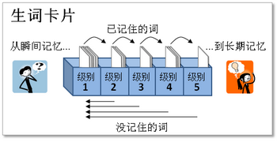

# 需求評估

## 字彙

### 英文單字字根、字首、字尾練習頁面

字卡，搭配句子，並分為中翻英or英翻中兩種型式，並可互相關聯相同字根、字首、字尾之單字。

結合遺忘曲線(萊特納的學習卡片箱)

### 英文單字字根、字首、字尾維護頁面

供輸入單字(中英)及單字之字根(中英)、字首(中英)、字尾(中英)、句子(中英)

## 文法

風火輪文法解析，分步驟去解析英文句型。

### 英文文法練習頁面(待讀書)

分步驟讓使用者選擇/填寫相應答案or解析步驟

### 英文文法維護頁面(待讀書)

分步驟，輸入各步驟結果

## 閱讀(待後續)

## 翻譯(待後續)

## 學習數據

單字(中英)及單字之字根(中英)、字首(中英)、字尾(中英)、句子(中英)
